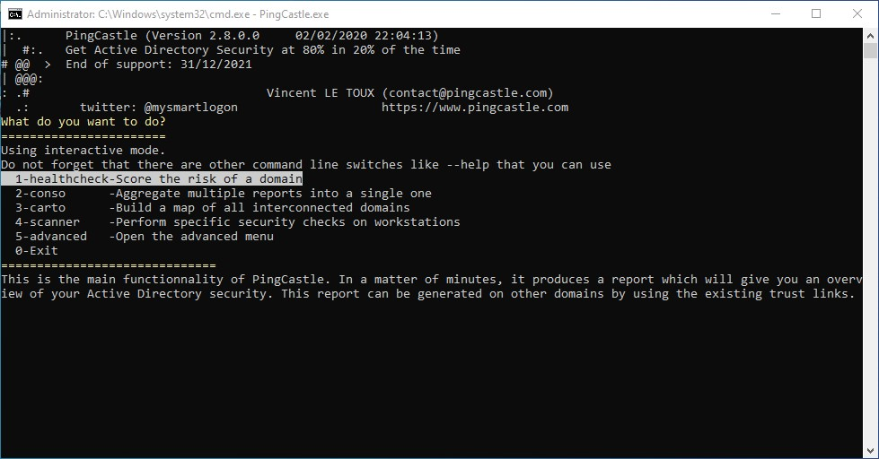

## Bloodhound
```bash
sudo neo4j console
bloodhound
```
Bloodhound ingestor
```bash
sudo bloodhound-python -d <DOMAIN> -u <USERNAME> -p <PASSWORD> -ns <DC IP> -c all
```
## LDAPDomainDump 
```bash
ldapdomaindump ldaps://<LDAP_SERVER> -u <DOMAIN\USERNAME> -p <PASSWORD>

ldapdomaindump ldaps://10.0.2.15 -u 'MARVEL\fcastle' -p Password1
```
## Plumhound

Plumhound will analyze information of Bloodhound and generate report.

```bash
# Neo4j console and Bloodhound must not be closed
sudo python3 PlumHound.py -x tasks/default.tasks -p <Neo4j PASSWORD>
```
The `index.html` file will contain all information.
## PingCastle
Active Directory audit scanner (ran to do checks on the system).

A report can be generated; domain risk scores is evaluated: state current risks and mitigation techniques.

